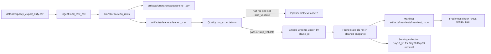

# Kiến trúc pipeline — Lab Day 10

**Nhóm:** Nhom69-E403  
**Cập nhật:** 15/04/2026

---

## 1. Sơ đồ luồng (bắt buộc có 1 diagram: Mermaid / ASCII)

Pipeline ghi `run_id` ở log và manifest để truy lineage từ raw đến index publish. Freshness được đo từ `latest_exported_at` trong manifest với SLA 24 giờ (theo contract), và quarantine được tách thành file riêng theo từng run.

---

## 2. Ranh giới trách nhiệm

| Thành phần | Input | Output | Owner nhóm |
|------------|-------|--------|--------------|
| Ingest | `data/raw/policy_export_dirty.csv` | `raw_records`, `run_id`, log khởi chạy | Khuất Văn Vương |
| Transform | Raw rows | `cleaned_<run_id>.csv`, `quarantine_<run_id>.csv`, chuẩn hoá ngày và refund fix | Lưu Lương Vi Nhân |
| Quality | Cleaned rows | Expectation results (warn/halt), gate cho embed | Lưu Lương Vi Nhân |
| Embed | Cleaned CSV hợp lệ | Upsert vào Chroma `day10_kb`, prune id cũ, metadata theo run | Nguyễn Đông Hưng |
| Monitor | Manifest + eval CSV + quarantine | Freshness status, incident handling trong runbook, tổng hợp report | Huỳnh Văn Nghĩa |

---

## 3. Idempotency & rerun

Pipeline dùng chiến lược snapshot publish để đảm bảo idempotent.

- `chunk_id` được sinh ổn định từ `doc_id + chunk_text + seq`, nên cùng dữ liệu sạch sẽ tạo cùng khóa.
- Embed dùng `upsert(ids=chunk_id)` nên rerun cùng cleaned snapshot không tạo duplicate vector.
- Trước khi upsert, pipeline lấy toàn bộ id hiện có trong collection rồi prune các id không còn xuất hiện ở cleaned run mới.

Kết quả quan sát từ artifact final cho thấy rerun ổn định:

- `manifest_final-clean.json`: `raw=10`, `cleaned=6`, `quarantine=4`
- `manifest_final-clean-after-fix.json`: `raw=10`, `cleaned=6`, `quarantine=4`
- Eval sau fix trả về `q_refund_window hits_forbidden=no`, xác nhận index đã được làm sạch chunk stale sau rerun.

---

## 4. Liên hệ Day 09

Day 10 dùng cùng domain CS + IT Helpdesk như Day 09 nhưng tách collection mặc định là `day10_kb` để thử nghiệm observability an toàn (inject/fix) mà không ảnh hưởng ngay luồng agent trước đó. Khi cần tích hợp lại Day 09, nhóm có hai lựa chọn:

- Trỏ retrieval worker Day 09 sang collection `day10_kb` sau khi xác nhận run sạch (`final-clean-after-fix`).
- Hoặc giữ worker Day 09 hiện tại và dùng Day 10 như tầng publish/quality gate trước khi đồng bộ vào collection production-like.

Mục tiêu là buộc quality checks (expectation + freshness + eval) chạy trước khi agent tiêu thụ dữ liệu.

---

## 5. Rủi ro đã biết

- Freshness thường FAIL trên bộ mẫu vì `latest_exported_at` cũ (snapshot lab), cần diễn giải rõ là tín hiệu nguồn stale chứ không phải lỗi runtime.
- Nếu chạy với `--skip-validate`, pipeline vẫn có thể embed dữ liệu xấu; cờ này chỉ dùng cho Sprint 3 inject demo.
- Chưa đo freshness ở 2 boundary (`ingest` + `publish`), nên chưa có cảnh báo sâu cho drift theo từng chặng.
- Log runtime chưa được commit đầy đủ vào `artifacts/logs/`, làm giảm khả năng audit khi peer review.
